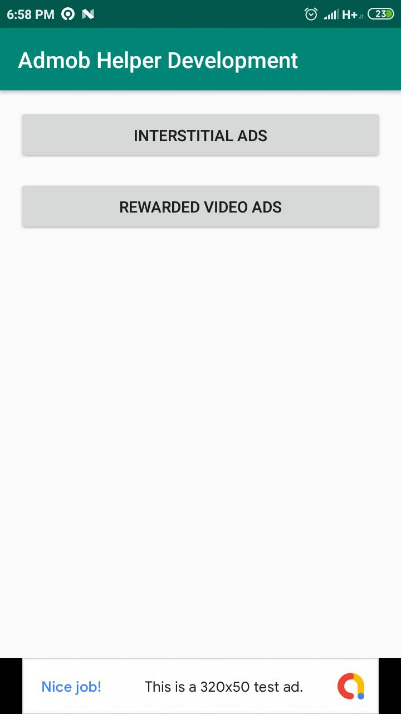

# Admob Helper Implementation By Amirisback
Helper for activating admob
- v1.0.0 - Development

# About This Project
Example Source Code For Call Method Show Admob
- Calling method on Inheritance Class
- Implement all Admob Version

# Medium Link
https://medium.com/@faisalamircs/dapatkan-penghasilan-dari-aplikasi-androidmu-di-play-store-dengan-admob-helper-f21288de5071

# How To Use This Project
- Just Clone on Your Android Studio
- Learn this code project for inject to your project
- String test ads can found on build.gradle in folder app
- Change in release build variant on build.gradle with your admob id

# Result Of This Project
- All logic on AdmobHelper and BaseActivity
- All layout banner
- All string test ads
- Implement, interstitial and banner ads
- Other still progress

# Special From This Project
- Inheritance RecyclerViewAdapter (BaseViewAdapter, BasViewHolder, BaseListener)
- Inheritance AdmobActivity (BaseAdmobActivity, BaseAdmobRecyclerActivity)
- AdmobHelper.kt class for all function admob
- Example all layout for all banner ads size
- Certainly Clean Code

# Minus From This Project
- Comment code are too simple
- Only one thought is the creator of the project
- Creator of this project indeed need your help

# ScreenShot Apps

# Colaborator
Very open to anyone, I'll write your name under this, please contribute by sending an email to me

- Mail To faisalamircs@gmail.com
- Subject : Github _ [Github-Username-Account] _ [Language] _ [Repository-Name]
- Example : Github_amirisback_kotlin_admob-helper-implementation

Name Of Contribute
- Muhammad Faisal Amir
- Waiting List
- Waiting List

Waiting for your contribute

# Library GMS Ads
implementation 'com.google.android.gms:play-services-ads:18.3.0'

# Source
Link Google Sample
https://github.com/googleads/googleads-mobile-android-examples

# Attention !!!
Please enjoy and don't forget fork and give a star
- Don't Forget Follow My Github Account
