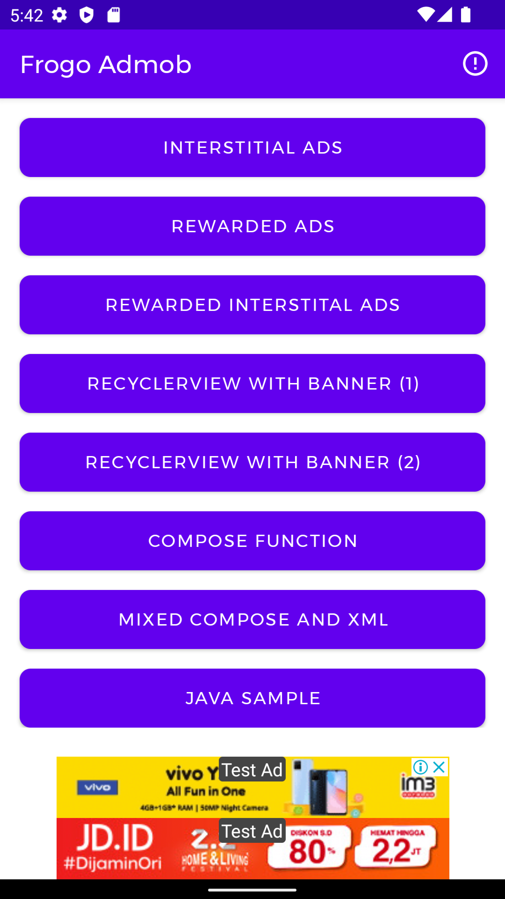
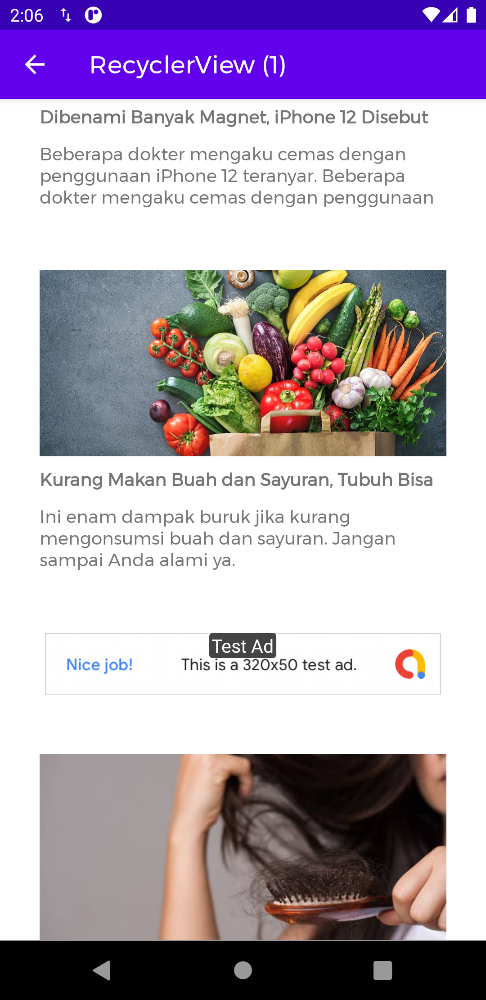
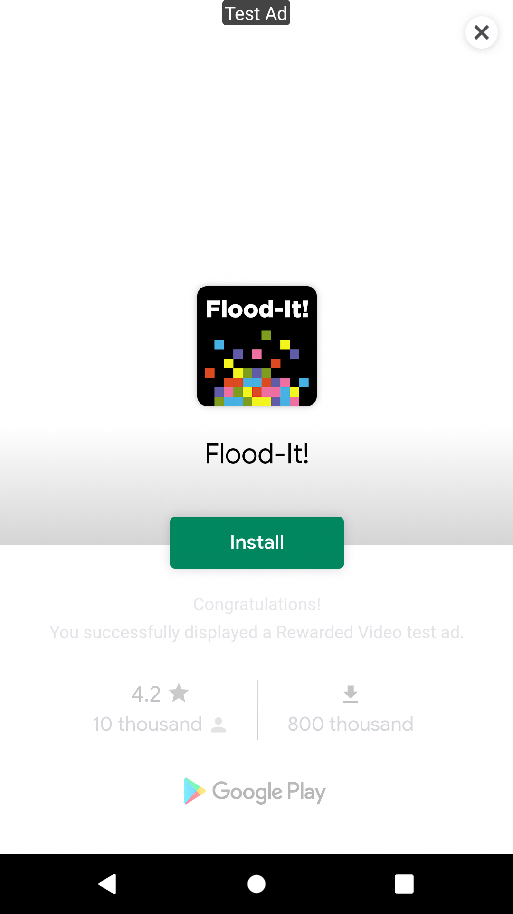

## About This Project
[](https://android-arsenal.com/details/1/8251)
[](https://jitpack.io/#amirisback/frogo-admob)
[](https://github.com/amirisback/frogo-admob/actions/workflows/android-ci.yml)
[](https://github.com/amirisback/frogo-admob/actions/workflows/detekt-analysis.yml)
[](https://medium.com/@faisalamircs/dapatkan-penghasilan-dari-aplikasi-androidmu-di-play-store-dengan-admob-helper-f21288de5071)
- Available on Google Dev Library - [Click Here](https://devlibrary.withgoogle.com/products/android/repos/amirisback-frogo-admob)
- Privacy Policy [Click Here](https://github.com/amirisback/frogo-admob/blob/master/PRIVACY-POLICY.md)
- LICENSE [Click Here](https://github.com/amirisback/frogo-admob/blob/master/LICENSE)
- Helper for activating admob
- Example Source Code For Call Method Show Admob
- Calling method on Inheritance Class
- Implement all Admob Version
- Jetpack Compose Function (Experimental)
- Don't forget implement frogo-sdk [Click Here](https://github.com/frogobox/frogo-sdk)

## Note For Jitpack Build
- Red : Failed (So don't use that version / Using previous version)
- Green : Success / Pass (Use It)

## ScreenShot Apps
|                      Banner and Interstitial                       |                      RecyclerView with Banner                      |                           Rewarded Apps                            |
|:------------------------------------------------------------------:|:------------------------------------------------------------------:|:------------------------------------------------------------------:|
|  |  |  |

## Version Release

    $version_release = 5.1.5

    // Suport Library
    $admob_version = 21.4.0
    $unity_ad_version = 4.5.0

What's New??

    * Enhance Performance *
    * Refactoring Code *
    * Update Admob Library Version 21.4.0 *
    * Update : Adding Function Request Admob From Server *
    * Add FrogoSdkAdmobActivity *
    * New Setup Implementation *
    * Fixing Bug : ShowBanner, ShowInterstitial, ShowRewarded *
    * Adding Unity Ads *
    * Add http timeout millis for google admob interstitial ad *
    * Add keyword for google admob ad *
    * Add keyword for google admob banner ad *
    * Add keyword for google admob interstitial ad *
    * Deprecated Code *
    * BIG UPDATE ON PROGRESS *

## How To Use / Implement This Project
### Step 1. Add the JitPack repository to your build file

#### <Option 1> Groovy Gradle

    // Add it in your root build.gradle at the end of repositories:

    allprojects {
        repositories {
            ...
            maven { url 'https://jitpack.io' }
        }
    }

#### <Option 2> Kotlin DSL Gradle`

```kotlin
// Add it in your root build.gradle.kts at the end of repositories:

allprojects {
    repositories {
        ...
        maven("https://jitpack.io")
    }
}
```

### Step 2. Add the dependency

#### <Option 1> Groovy

	dependencies {
        // library google admob (Required)
        implementation 'com.google.android.gms:play-services-ads:${admob_version}'

        // library unity ads (Required)
        implementation 'com.unity3d.ads:unity-ads:${unity_ad_version}'

        // library frogo-admob (Required - Recomended)
        implementation 'com.github.amirisback:frogo-admob:5.1.5'

        // -----------------------------------------------------------------------------------------
        // For Single Library Patch 

        // library frogo-admob (Admob Only)
        implementation 'com.github.amirisback.frogo-admob:frogoadmob:5.1.5'

        // library frogo-admob (Unity Ads Only)
        implementation 'com.github.amirisback.frogo-admob:frogounityad:5.1.5'
	}

#### <Option 2> Kotlin DSL

	dependencies {
        // library google admob (Required)
        implementation("com.google.android.gms:play-services-ads:${admob_version}")

        // library unity ads (Required)
        implementation("com.unity3d.ads:unity-ads:${unity_ad_version}")

        // library frogo-admob (Required - Recomended)
        implementation("com.github.amirisback:frogo-admob:5.1.5")

        // -----------------------------------------------------------------------------------------
        // For Single Library Patch

        // library frogo-admob (Admob Only)
        implementation("com.github.amirisback.frogo-admob:frogoadmob:5.1.5")

        // library frogo-admob (Unity Ads Only)
        implementation("com.github.amirisback.frogo-admob:frogounityad:5.1.5")

	}
	
### Step 3. Adding meta-data on AndroidManifest.xml
```xml
<manifest>
    <application>
        <!-- Sample AdMob App ID: ca-app-pub-3940256099942544~3347511713 -->
        <meta-data
            android:name="com.google.android.gms.ads.APPLICATION_ID"
            android:value="ca-app-pub-xxxxxxxxxxxxxxxx~yyyyyyyyyy"/>
    </application>
</manifest>
```
	
### Step 4. Setup Admob and Showing Ads

#### XML
<details>
  <summary>Click for detail!</summary>

#### Setup Ads Using Server
```kotlin
class <YourActivity> : FrogoAdActivity() {

    override fun onCreate(savedInstanceState: Bundle?) {
        super.onCreate(savedInstanceState)
        requestAdmobApi()
    }

    private fun requestAdmobApi() {
        val baseUrl = "https://raw.githubusercontent.com/amirisback/frogo-admob/master/app/src/main/assets/"
        val frogoAdmobRepository = FrogoAdmobRepository(baseUrl)
        frogoAdmobRepository.usingClient()
        frogoAdmobRepository.getFrogoAdmobId(
            "admob_id",
            object : FrogoAdmobApiResponse<FrogoAdmobId> {
                override fun onSuccess(data: FrogoAdmobId) {
                    runOnUiThread {
                        showLogDebug(data.appId)
                        showLogDebug(data.bannerID[0])
                        showLogDebug(data.interstitialID[0])
                        showLogDebug(data.testAdmobAppId)
                        showLogDebug(data.testAdmobBanner)
                        showLogDebug(data.testAdmobInterstitial)
                    }
                }

                override fun onFailed(statusCode: Int, errorMessage: String?) {
                    runOnUiThread {
                        showLogDebug(errorMessage)
                    }
                }

                override fun onShowProgress() {
                }

                override fun onHideProgress() {
                }
            })
    }

}
```

#### Showing Ads

```kotlin
class <YourActivity> : FrogoAdmobActivity() {

    override fun onCreate(savedInstanceState: Bundle?) {
        super.onCreate(savedInstanceState)
        setupButtonClick()
        setupBannerAds()
    }

    ...
    ...
    ...

    private fun setupBannerAds() {
        showBanner(binding.adsXml.adsPhoneTabSpecialSmartBanner)
        showBannerContainer(
            getString(R.string.admob_banner),
            AdSize.SMART_BANNER,
            binding.includeAdsView.frogoAdsBanner
        )
    }

    private fun setupButtonClick() {

        binding.apply {

            btnInterstitial.setOnClickListener {

                // No Using Callback
                showAdInterstitial(getString(R.string.admob_interstitial))

                // With Callback
                showAdInterstitial(
                    getString(R.string.admob_interstitial),
                    object : IFrogoInterstitial {

                        override fun onAdDismissed(message: String) {
                            frogoStartActivity<MainActivity>()
                            finish()
                        }

                        override fun onAdFailedToLoad(errorMessage: String) {
                            frogoStartActivity<MainActivity>()
                            finish()
                        }

                        override fun onAdFailedToShow(errorMessage: String) {
                            frogoStartActivity<MainActivity>()
                            finish()
                        }

                        override fun onAdLoaded(message: String) {}

                        override fun onAdShowed(message: String) {}

                        override fun onAdNotReady(message: String) {
                            frogoStartActivity<MainActivity>()
                            finish()
                        }

                    }
                )

            }

            btnRewarded.setOnClickListener {
                showAdRewarded(getString(R.string.admob_rewarded), object : FrogoAdmobRewardedCallback {
                    override fun onUserEarnedReward(rewardItem: RewardItem) {
                        // TODO("User Get Reward")
                    }

                    override fun onAdClosed() {
                        // TODO("Not yet implemented")
                    }

                    override fun onAdFailedToLoad() {
                        // TODO("Not yet implemented")
                    }

                    override fun onAdFailedToShow() {
                        // TODO("Not yet implemented")
                    }

                    override fun onAdLoaded() {
                        // TODO("Not yet implemented")
                    }

                    override fun onAdNotReady(message: String) {
                        // TODO("Not yet implemented")
                    }
                })
            }

            btnRewardedInterstitial.setOnClickListener {
                showAdRewardedInterstitial(getString(R.string.admob_rewarded_interstitial),
                    object : FrogoAdmobRewardedCallback {
                        override fun onUserEarnedReward(rewardItem: RewardItem) {
                            // TODO("User Get Reward")
                        }

                        override fun onAdClosed() {
                            // TODO("Not yet implemented")
                        }

                        override fun onAdFailedToLoad() {
                            // TODO("Not yet implemented")
                        }

                        override fun onAdFailedToShow() {
                            // TODO("Not yet implemented")
                        }

                        override fun onAdLoaded() {
                            // TODO("Not yet implemented")
                        }

                        override fun onAdNotReady(message: String) {
                            // TODO("Not yet implemented")
                        }
                    })
            }

        }

    }

}
```

</details>

#### Jetpack Compose

<details>
  <summary>Click for detail!</summary>

#### ComposeActivity

```kotlin

class ComposeActivity : ComponentActivity() {
    override fun onCreate(savedInstanceState: Bundle?) {
        super.onCreate(savedInstanceState)
        setContent {
            FrogoAdmobTheme {
                // A surface container using the 'background' color from the theme
                Surface(color = MaterialTheme.colors.background) {
                    Column {
                        FrogoAdmobBannerView(
                            mAdUnitID = getString(R.string.admob_banner),
                            mAdSize = adsize_banner
                        )
                    }
                }
            }
        }
    }
}

```

</details>

#### Hybrid (Jetpack Compose + XML)

<details>
  <summary>Click for detail!</summary>

#### XML Layout

```xml

<RelativeLayout xmlns:android="http://schemas.android.com/apk/res/android"
    xmlns:ads="http://schemas.android.com/apk/res-auto"
    xmlns:tools="http://schemas.android.com/tools"
    android:layout_width="match_parent"
    android:layout_height="match_parent"
    tools:context=".mvvm.main.MainActivity">

    <androidx.compose.ui.platform.ComposeView
        android:id="@+id/compose_view"
        android:layout_width="match_parent"
        android:layout_height="match_parent"
        android:layout_above="@id/include_ads_view"/>

    <include
        android:id="@+id/include_ads_view"
        layout="@layout/ads_phone_tab_special_smart_banner" />

</RelativeLayout>

```

#### Kotlin Class

```kotlin

class HybridActivity : BaseActivity<ActivityHybridBinding>() {

    override fun setupViewBinding(): ActivityHybridBinding {
        return ActivityHybridBinding.inflate(layoutInflater)
    }

    override fun onCreate(savedInstanceState: Bundle?) {
        super.onCreate(savedInstanceState)
        binding.apply {
            composeView.setContent {
                Greeting("FrogoAdmob")
            }

            setupShowAdsBanner(includeAdsView.adsPhoneTabSpecialSmartBanner)
        }

    }

    @Composable
    fun Greeting(name: String) {
        Text(text = "Hello $name!")
    }

}

```

</details>

#### Java Sample Implementation
- You can follow sample below or go to Full Sample Code [Full Code](https://github.com/amirisback/frogo-admob/tree/master/app/src/main/java/com/frogobox/appadmob/javasample)

<details>
  <summary>Click for detail!</summary>

### Setup Java BaseActivity
```java
public abstract class <Your BaseJavaActivity> extends FrogoAdmobActivity {

    @Override
    protected void onCreate(@Nullable Bundle savedInstanceState) {
        super.onCreate(savedInstanceState);
    }

}
```

### Setup Your Activity

```java

public class MainJavaActivity extends BaseJavaActivity {

    private ActivityMainBinding binding;

    @Override
    protected void onCreate(Bundle savedInstanceState) {
        super.onCreate(savedInstanceState);
        binding = ActivityMainBinding.inflate(LayoutInflater.from(this));
        setContentView(binding.getRoot());
        showBanner(binding.includeAdsView.adsPhoneTabSpecialSmartBanner);
        hideButton();
        setupButtonClick();
    }

    ...
    ...
    ...

    private void setupButtonClick() {

        binding.btnInterstitial.setOnClickListener(new View.OnClickListener() {
            @Override
            public void onClick(View view) {
                showAdInterstitial(getString(R.string.admob_interstitial))
            }
        });

        binding.btnRewarded.setOnClickListener(view -> showAdRewarded(getString(R.string.admob_rewarded), new FrogoAdmobRewardedCallback() {
            @Override
            public void onUserEarnedReward(@NonNull RewardItem rewardItem) {

            }

            @Override
            public void onAdClosed() {

            }

            @Override
            public void onAdFailedToLoad() {

            }

            @Override
            public void onAdFailedToShow() {

            }

            @Override
            public void onAdLoaded() {

            }

            @Override
            public void onAdNotReady(@NonNull String message) {

            }
        }));

        binding.btnRewardedInterstitial.setOnClickListener(view -> showAdRewardedInterstitial(getString(R.string.admob_rewarded_interstitial), new FrogoAdmobRewardedCallback() {
            @Override
            public void onUserEarnedReward(@NonNull RewardItem rewardItem) {

            }

            @Override
            public void onAdClosed() {

            }

            @Override
            public void onAdFailedToLoad() {

            }

            @Override
            public void onAdFailedToShow() {

            }

            @Override
            public void onAdLoaded() {

            }

            @Override
            public void onAdNotReady(@NonNull String message) {

            }

        }));

    }

}

```

</details>

## List Function FrogoAdmobActivity and FrogoSdkAdmobActivity
```kotlin
// Show Ad Consent
fun showAdConsent()

// ---------------------------------------------------------------------------------------------

// Show Banner Ads
fun showAdBanner(mAdView: AdView)

// Show Banner Ads with timeout millisecond
fun showAdBanner(mAdView: AdView, timeoutMilliSecond: Int)

// Show Banner Ads with keyword
fun showAdBanner(mAdView: AdView, keyword: List<String>)

// Show Banner Ads with timeout millisecond and keyword
fun showAdBanner(mAdView: AdView, timeoutMilliSecond: Int, keyword: List<String>)

// Show Banner Ads  with timeout millisecond and keyword and callback
fun showAdBanner(
    mAdView: AdView,
    timeoutMilliSecond: Int,
    keyword: List<String>,
    callback: FrogoAdmobBannerCallback
)

// Show Banner Ads with callback
fun showAdBanner(mAdView: AdView, callback: FrogoAdmobBannerCallback)

// Show Banner Ads  with timeout millisecond and callback
fun showAdBanner(mAdView: AdView, timeoutMilliSecond: Int, callback: FrogoAdmobBannerCallback)

// Show Banner Ads  with and keyword and callback
fun showAdBanner(mAdView: AdView, keyword: List<String>, callback: FrogoAdmobBannerCallback)

// ---------------------------------------------------------------------------------------------

// Show Banner Ads with container
fun showAdBannerContainer(
    bannerAdUnitId: String,
    mAdsSize: AdSize,
    container: RelativeLayout,
)

// Show Banner Ads with container and timeout millisecond
fun showAdBannerContainer(
    bannerAdUnitId: String,
    mAdsSize: AdSize,
    container: RelativeLayout,
    timeoutMilliSecond: Int,
)

// Show Banner Ads with container and keyword
fun showAdBannerContainer(
    bannerAdUnitId: String,
    mAdsSize: AdSize,
    container: RelativeLayout,
    keyword: List<String>,
)

// Show Banner Ads with container and keyword and timeout millisecond
fun showAdBannerContainer(
    bannerAdUnitId: String,
    mAdsSize: AdSize,
    container: RelativeLayout,
    timeoutMilliSecond: Int,
    keyword: List<String>
)

// Show Banner Ads with container and callback
fun showAdBannerContainer(
    bannerAdUnitId: String,
    mAdsSize: AdSize,
    container: RelativeLayout,
    callback: FrogoAdmobBannerCallback
)

// Show Banner Ads with container and timeout millisecond and callback
fun showAdBannerContainer(
    bannerAdUnitId: String,
    mAdsSize: AdSize,
    container: RelativeLayout,
    timeoutMilliSecond: Int,
    callback: FrogoAdmobBannerCallback
)

// Show Banner Ads with container and keyword and callback
fun showAdBannerContainer(
    bannerAdUnitId: String,
    mAdsSize: AdSize,
    container: RelativeLayout,
    keyword: List<String>,
    callback: FrogoAdmobBannerCallback
)

// Show Banner Ads with container and timeout millisecond and keyword and callback
fun showAdBannerContainer(
    bannerAdUnitId: String,
    mAdsSize: AdSize,
    container: RelativeLayout,
    timeoutMilliSecond: Int,
    keyword: List<String>,
    callback: FrogoAdmobBannerCallback
)

// ---------------------------------------------------------------------------------------------

// Show Interstitial Ads with timeout millisecond, keyword, callback
fun showAdInterstitial(
    interstitialAdUnitId: String,
    timeoutMilliSecond: Int,
    keyword: List<String>,
    callback: FrogoAdmobInterstitialCallback
)

// Show Interstitial Ads with timeout millisecond and keyword
fun showAdInterstitial(
    interstitialAdUnitId: String,
    timeoutMilliSecond: Int,
    keyword: List<String>
)

// Show Interstitial Ads with timeout millisecond
fun showAdInterstitial(
    interstitialAdUnitId: String,
    timeoutMilliSecond: Int
)

// Show Interstitial Ads with keyword
fun showAdInterstitial(
    interstitialAdUnitId: String,
    keyword: List<String>
)

// Show Interstitial Ads
fun showAdInterstitial(interstitialAdUnitId: String)

// Show Interstitial Ads with timeout milliSecond and callback
fun showAdInterstitial(
    interstitialAdUnitId: String,
    timeoutMilliSecond: Int,
    callback: FrogoAdmobInterstitialCallback
)

// Show Interstitial Ads with keyword and callback
fun showAdInterstitial(
    interstitialAdUnitId: String,
    keyword: List<String>,
    callback: FrogoAdmobInterstitialCallback
)

// Show Interstitial Ads with callback
fun showAdInterstitial(
    interstitialAdUnitId: String,
    callback: FrogoAdmobInterstitialCallback
)

// ---------------------------------------------------------------------------------------------

// Show Rewarded Ads
fun showAdRewarded(mAdUnitIdRewarded: String, callback: FrogoAdmobRewardedCallback)

// Show Rewarded Ads with timeout millisecond
fun showAdRewarded(
    mAdUnitIdRewarded: String,
    timeoutMilliSecond: Int,
    callback: FrogoAdmobRewardedCallback
)

// Show Rewarded Ads with keyword
fun showAdRewarded(
    mAdUnitIdRewarded: String,
    keyword: List<String>,
    callback: FrogoAdmobRewardedCallback
)

// Show Rewarded Ads with timeout millisecond and keyword
fun showAdRewarded(
    mAdUnitIdRewarded: String,
    timeoutMilliSecond: Int,
    keyword: List<String>,
    callback: FrogoAdmobRewardedCallback
)

// ---------------------------------------------------------------------------------------------

// Show Rewarded Interstitial Ads
fun showAdRewardedInterstitial(
    mAdUnitIdRewardedInterstitial: String,
    callback: FrogoAdmobRewardedCallback
)

// Show Rewarded Interstitial Ads with timeout millisecond
fun showAdRewardedInterstitial(
    mAdUnitIdRewardedInterstitial: String,
    timeoutMilliSecond: Int,
    callback: FrogoAdmobRewardedCallback
)

// Show Rewarded Interstitial Ads with keyword
fun showAdRewardedInterstitial(
    mAdUnitIdRewardedInterstitial: String,
    keyword: List<String>,
    callback: FrogoAdmobRewardedCallback
)

// Show Rewarded Interstitial Ads with timeout millisecond and keyword
fun showAdRewardedInterstitial(
    mAdUnitIdRewardedInterstitial: String,
    timeoutMilliSecond: Int,
    keyword: List<String>,
    callback: FrogoAdmobRewardedCallback
)

// ---------------------------------------------------------------------------------------------

// Unity Ads

fun setupUnityAdApp(
    testMode: Boolean,
    unityGameId: String
)

fun setupUnityAdApp(
    testMode: Boolean,
    unityGameId: String,
    callback: IFrogoUnityAdInitialization
)

fun showUnityAdInterstitial(
    adInterstitialUnitId: String
)

fun showUnityAdInterstitial(
    adInterstitialUnitId: String,
    callback: IFrogoUnityAdInterstitial
)

// ---------------------------------------------------------------------------------------------

fun showAdmobXUnityAdInterstitial(
    admobInterstitialId: String,
    unityInterstitialId: String,
    callback: IFrogoMixedAdsInterstitial
)

fun showUnityXAdmobAdInterstitial(
    admobInterstitialId: String,
    unityInterstitialId: String,
    callback: IFrogoMixedAdsInterstitial
)
```

## Jetpack Compose Element

### Variable

```kotlin
val adsize_banner: AdSize = AdSize.BANNER
val adsize_full_banner: AdSize = AdSize.FULL_BANNER
val adsize_large_banner: AdSize = AdSize.LARGE_BANNER
val adsize_smart_banner: AdSize = AdSize.SMART_BANNER
val adsize_medium_rectangle: AdSize = AdSize.MEDIUM_RECTANGLE
val adsize_wide_skycraper: AdSize = AdSize.WIDE_SKYSCRAPER
```

### Function

```kotlin

@Composable
fun FrogoAdmobBannerView(
    mAdUnitID: String,
    mAdSize: AdSize,
    modifier: Modifier = Modifier
) {
    AndroidView(
        modifier = modifier.fillMaxWidth(),
        factory = { context ->
            showLogDebug("FrogoAdmobBannerView")
            AdView(context).apply {
                adSize = mAdSize
                adUnitId = mAdUnitID
                loadAd(AdRequest.Builder().build())
            }
        }
    )
}

```

## Allert

### Update

    >> on version 3.0.0
    - import com.frogobox.admob.core.FrogoRvConstant
    - import com.frogobox.admob.core.admob.FrogoAdmob
    - import com.frogobox.admob.core.admob.FrogoAdmobActivity
    - import com.frogobox.admob.core.FrogoAdmobViewHolder
    - import com.frogobox.admob.core.FrogoAdmobViewAdapter
    - import com.frogobox.admob.core.AdmobViewHolder

    >> on version 4.0.0
    - import com.frogobox.admob.core.FrogoRvConstant
    - import com.frogobox.admob.core.FrogoAdmob
    - import com.frogobox.admob.ui.FrogoAdmobActivity
    - import com.frogobox.admob.widget.FrogoAdmobViewHolder
    - import com.frogobox.admob.widget.FrogoAdmobViewAdapter
    - import com.frogobox.admob.widget.AdmobViewHolder

    >> on Version 4.2.0
    - Add FrogoSdkAdmobActivity
    - New Setup Implementation
    - Fixing Bug : ShowBanner, ShowInterstitial, ShowRewarded

    >> on Version 4.2.6 +
    - Add Unity Ads
    - Basic Interstitial

### Test Ads From Google

    // Declaration admob id for debug
    def debugAdmobAppId = "ca-app-pub-3940256099942544~3347511713"
    def debugAdmobBanner = "ca-app-pub-3940256099942544/6300978111"
    def debugAdmobInterstitial = "ca-app-pub-3940256099942544/1033173712"
    def debugAdmobInterstitialVideo = "ca-app-pub-3940256099942544/8691691433"
    def debugAdmobRewarded = "ca-app-pub-3940256099942544/5224354917"
    def debugAdmobRewardedInterstitial = "ca-app-pub-3940256099942544/5354046379"
    def debugAdmobNativeAdvanced = "ca-app-pub-3940256099942544/2247696110"
    def debugAdmobNativeAdvancedVideo = "ca-app-pub-3940256099942544/1044960115"

## Colaborator
Very open to anyone, I'll write your name under this, please contribute by sending an email to me

- Mail To faisalamircs@gmail.com
- Subject : Github _ [Github-Username-Account] _ [Language] _ [Repository-Name]
- Example : Github_amirisback_kotlin_admob-helper-implementation

Name Of Contribute
- Muhammad Faisal Amir
- Waiting List
- Waiting List

Waiting for your contribute

## Source
- Google Sample Code [Click Here](https://github.com/googleads/googleads-mobile-android-examples)
- Test Ads [Click Here](https://developers.google.com/admob/android/test-ads)
- For Get Started [Click Here](https://developers.google.com/admob/android/quick-start)

## Attention !!!
Please enjoy and don't forget fork and give a star
- Don't Forget Follow My Github Account


